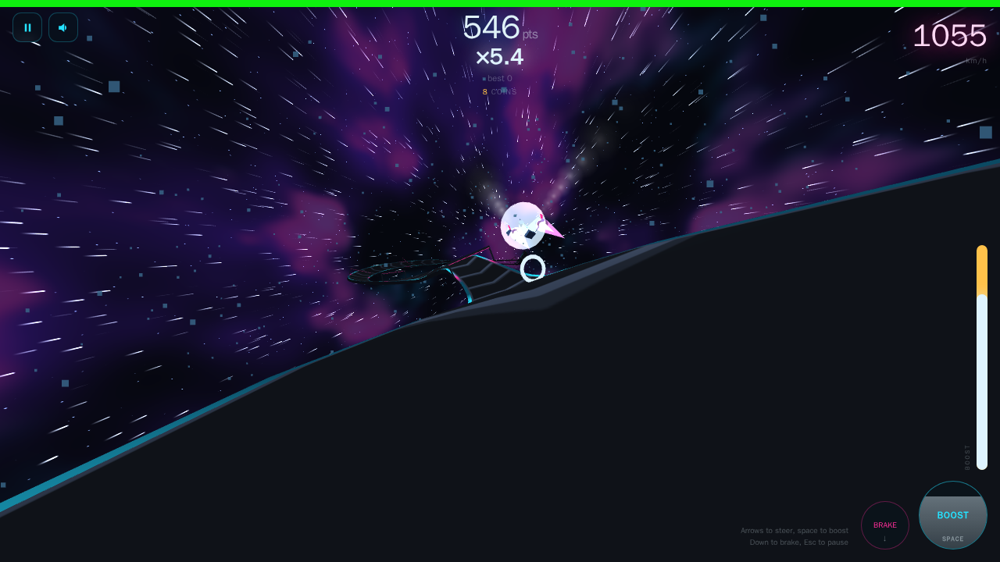

# G-SURGE

[](https://github.com/fchaussin/g-surge/actions/workflows/ci.yml)
[](package.json)
[](https://g-surge.w23.fr/)
[](#install-it)
[](tsconfig.base.json)
[](docs/TECH-DEBT.md#7-threejs-r128)
[](docs/ARCHITECTURE.md#the-core-srcsim)

An endless antigrav runner. One ship, one track that never repeats and never
ends — banked corners, corkscrews, jumps — and a score that is speed multiplied
by a live multiplier, added up every instant. Drift to charge, boost to score,
climb the ladder to the state the game is named after.

[](https://g-surge.w23.fr/)

| | |
|---|---|
| **Play** | <https://g-surge.w23.fr/> |
| **Latest build** | <https://g-surge.pages.dev/> — every push to `main`, the version and commit stamped in the menu |

No account, no download, no assets to fetch: about 160 KB compressed, most of
it three.js. It runs in any browser, installs as an app on a phone or a
desktop, and works offline once installed.

## How to play

**Steer, boost, brake.** On a keyboard, left and right arrows steer, Space or
up boosts, down brakes, Esc pauses. On a phone, a thumb anywhere on the lower
left is the stick — it appears where you press and steers left and right —
and the BOOST and BRAKE pads sit on the right, under the gauge. A left-handed
layout is in Settings.

**The score is speed × multiplier, every instant.** Distance on its own is
worth little; speed is what pays, and the multiplier is what makes it pay a
lot. Coins raise it, it erodes on its own, and **hitting a wall halves it**.
Above 1000 km/h it erodes half as fast, so holding top speed protects what you
built.

**Drifting is the engine of everything.** Push hard into a corner until grip
breaks: the ship slides wide while pointing into the turn, the hull glows, the
gauge pulses. A drift refills the boost reserve much faster than cruising, and
it is the only way up the ladder. Chain them without touching a wall and the
**Perfect Drift** kicks in from the third: every drift pays points and the
climb runs faster, as long as the next drift starts before the window closes.
Skim a wall without touching it and the **Near Miss** pays points and a little
boost, more the closer and the faster. A violet ring grants a few seconds of
**invincibility**, during which a wall pushes instead of biting: lean on the
outside of a corner and ride it.

**The ladder has four rungs, and the vertical gauge is the ladder.**

| Rung | How you get there | The gauge | Coins pay |
|---|---|---|---|
| Cruise | where you start | the gold reserve, refilled by drifting | a little |
| Boost | hold BOOST while the reserve lasts | spent while you hold | more |
| Super boost | a magenta pickup — or **earn it**: drift cleanly under boost until the white layer reaches the top | white, counting down five seconds | more again |
| G-SURGE | **earned only**: keep drifting cleanly during a super boost until the warm white layer reaches the top | warm white, counting down five seconds | the most |

Found or earned, a super boost lasts the same and pins a full reserve. The
G-SURGE does not go faster — it goes quiet and white: the engine drops away,
the edges of the screen blur, and for five seconds the world closes in.
Touching a wall empties whatever you were climbing. As a rung ends, its layer
drains and uncovers the one below.

**Damage.** The bar along the top is your hull. Impacts cost in proportion to
how hard you hit, scraping along a wall drains it continuously, landing off
track after a jump hurts, and damage cuts your top speed, your steering and
your boost recharge. At zero the run ends. Green pickups repair.

**Three difficulties.** Easy is the reference. Medium tightens the corners,
reaches top speed sooner, makes impacts cost more and the multiplier fade
faster. Hard does all of that harder, with scarce repairs. A harder level
scores its runs with a coefficient, so it is never worth less.

The full reference, with every number and where it lives in the code, is
[`docs/GAMEPLAY.md`](docs/GAMEPLAY.md) — its tables are generated from the
tuning and a test fails if they drift.

## Install it

It is a progressive web app. On Android and desktop Chrome the menu offers
**INSTALL APP** when the browser allows it; on iPhone and iPad, use Share, then
**Add to Home Screen**. The installed app runs full screen in landscape, works
offline, and tells you when a new version is ready — you choose when to
restart.

`?seed=anything` pins the track: <https://g-surge.w23.fr/?seed=alpha> is the
same track for everyone who opens it.

## For developers

TypeScript, Vite, three.js pinned to r128. The simulation is a seeded,
fixed-step core that runs without a browser and is bit-identical across
engines; the client draws it. `CLAUDE.md` is the rulebook, the documents below
are the map.

## Layout

```
index.html         Vite entry point, markup and all the CSS
src/
  sim/             the simulation — no DOM, no three.js, no Math.cos, runs in Node
  client/          rendering, UI, audio, input, loop
static/            copied verbatim into the build: _headers, manifest, sw.js
tests/
  *.test.ts        Vitest: PRNG, clock, parity against the frozen references
  e2e/             Playwright against the built artefact
scripts/
  serve-static.mjs dependency-free static server, used by the e2e suite
public/            build output, gitignored — what Cloudflare Pages serves
```

## Local

    npm install
    npm run dev          # http://localhost:5173, hot reload
    npm run build        # compiles src/ into public/
    npm run verify       # types, lint, unit tests
    npm run test:e2e     # Playwright, in Docker

`npm run verify` is the command to run after any change; `test:e2e` before
anything that touches rendering or the interface.

**`test:e2e` runs in the official Playwright container, and that is deliberate.**
Interface screenshots are compared at zero pixel tolerance and text rendering
depends on the system's fonts, so the references have to be generated and
verified in one pinned environment — the same image CI uses. `npm run
test:e2e:host` skips Docker for a quick loop, at the cost of failing every
reference that contains text.

`npm run test:e2e:update` regenerates the visual references and
`npm run fixtures:update` the simulation ones. Neither is routine.

The `?seed=` parameter pins the track: `http://localhost:5173/?seed=alpha`
replays exactly the same generation on every load. Without it, each run draws
its own seed.

## Docker

Same thing without installing anything on the machine — Node and Vite live in
the image:

    docker compose up --build          # http://localhost:5173
    docker compose run --rm tools npm run verify
    docker compose run --rm tools npm run build
    docker compose down

Sources are mounted, not copied: an edit is picked up by hot reload, and the
image only needs rebuilding when the `Dockerfile` changes. Change the port with
`GSURGE_PORT=8080`.

The local daemon runs rootless, where uid 0 inside the container is already the
host user, and `compose.yaml` assumes that. On a rootful daemon, run with
`GSURGE_USER="$(id -u):$(id -g)"` so that build output is not owned by root.

Playwright is not in the image. Run `npm run test:e2e` on the host.

## Deploying

On Cloudflare Pages. Every push to `main` builds and deploys
<https://g-surge.pages.dev/>; <https://g-surge.w23.fr/> is the same project
under its own domain. The stamp in the menu — version and commit — says which
build is running.

- Build command: `npm run build`
- Build output directory: `public`
- Node version: pinned by `.nvmrc`

`static/_headers` is copied into the build and sets the cache policy: `/`,
`index.html` and `sw.js` are never cached, icons are immutable. The service
worker only registers over https, so it stays out of the way in development,
and `src/client/updates.ts` announces a new version to an installed app — the
player restarts when they choose.

The README screenshot is taken by `npm run readme:shot`, in the Playwright
container, from a seeded run; `README_SHOT_SEEDS=a,b,c` shoots several
candidates into `test-results/` to choose from.

## Docs

| File | What it answers |
|---|---|
| `CLAUDE.md` | Rules for an agent working on this repo, and the traps already paid for |
| `docs/ARCHITECTURE.md` | How it works, and why the ship never moves |
| `docs/TECH-DEBT.md` | Honest state of the codebase, measured |
| `docs/ROADMAP.md` | What to do first, in order, without breaking things |
| `docs/GAMEPLAY.md` | Scoring, difficulty, handling, and the constants that matter |
| `docs/FX-PALETTE.md` | The sensory palette, and the G-SURGE specification in its §16 |
| `docs/TODO.md` | Decisions waiting on the author, with options and a recommendation |

## Known constraints

- three.js is pinned to r128 and bundled from npm. The code relies on r128
  behaviour, see `CLAUDE.md` before upgrading.
- The leaderboard lives in `localStorage` under `gsurge.scores.v2`, a key that tracks
  the scoring rules rather than the release. Private browsing falls back to
  memory for the session.
- Settings are persisted under `gsurge.prefs.v1`; the advanced tuning sliders
  are deliberately not.
- `navigator.vibrate` does not exist on iOS; the haptics switch hides itself.
